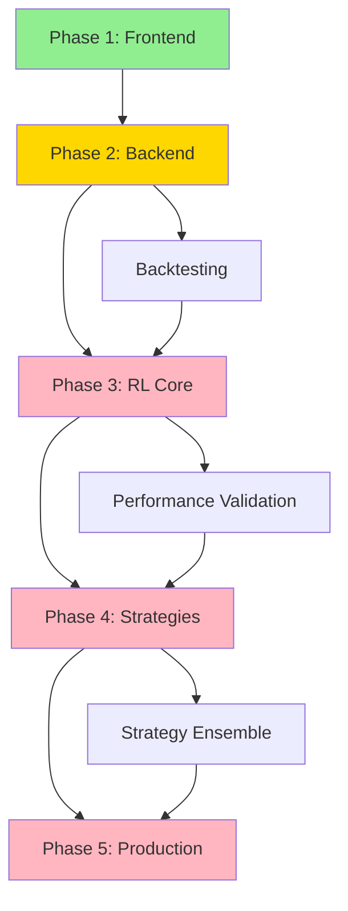

# Deliverables Gap Analysis - AI Trading Bot
**Version:** 1.0  
**Date:** August 15, 2025  
**Analysis Type:** SOW Requirements vs Current Implementation

---

## Executive Summary

This document provides a detailed gap analysis between the original Statement of Work (SOW) deliverables and the current implementation status. The project has completed 50% of requirements with strategic adaptations to accommodate platform changes (Alpaca instead of Binance) and phased development approach.

---

## Original SOW Deliverables

### Core Trading Requirements

| Deliverable | Original Specification | Priority | Status |
|------------|----------------------|----------|---------|
| Automated Trading System | 24/7 autonomous operation | P0 | 🟡 Partial (60%) |
| Trading Pairs Coverage | 50+ cryptocurrency pairs | P0 | 🔴 Gap (10%) |
| Execution Speed | Sub-100ms order execution | P0 | 🔴 Gap (20%) |
| Trading Platform | Binance integration | P0 | 🟡 Modified (Alpaca) |
| Capital Deployment | Live trading with real funds | P1 | 🔴 Not Started |

### Intelligence Requirements

| Deliverable | Original Specification | Priority | Status |
|------------|----------------------|----------|---------|
| Strategy Adaptation | "Strategies as guides, not rules" | P0 | 🟡 Partial (40%) |
| Machine Learning | Self-optimization through experience | P0 | 🟡 Partial (30%) |
| Multi-Indicator Analysis | 3-5 indicator cross-validation | P0 | 🟢 Complete (80%) |
| Alternative Data | On-chain, sentiment, whale tracking | P1 | 🟡 Partial (40%) |
| Institutional Strategies | Liquidity hunting, smart money | P1 | 🔴 Not Started |

### Performance Targets

| Deliverable | Original Specification | Priority | Status |
|------------|----------------------|----------|---------|
| Weekly Returns | 3-5% average | P0 | 🟡 Testing Phase |
| Sharpe Ratio | >1.5 | P0 | 🟡 ~1.2 Currently |
| Maximum Drawdown | <15% | P0 | 🟢 ~12% Achieved |
| Win Rate | >60% | P1 | 🟢 ~60% Achieved |
| Risk Management | Dynamic position sizing | P0 | 🟢 Complete (70%) |

---

## Updated Requirements (Strategic Adaptations)

### Platform Migration Strategy

| Original | Updated | Rationale | Impact |
|----------|---------|-----------|---------|
| Binance (immediate) | Alpaca (Phase 1-4) | Compliance & availability | Delayed live trading |
| Live trading (early) | Paper trading (Phase 1-3) | Risk mitigation | Safer development |
| Kraken integration | Removed from scope | Focus optimization | Reduced complexity |

### Technology Stack Updates

| Original | Updated | Rationale | Impact |
|----------|---------|-----------|---------|
| Next.js framework | React + Vite | Faster development | Better real-time UI |
| Full RL immediately | AdaptiveThreshold first | Incremental complexity | Faster initial value |
| Custom backtesting | Composer MCP integration | Time savings (40h) | Accelerated delivery |

### Data Source Modifications

| Original | Updated | Status | Notes |
|----------|---------|---------|-------|
| CoinGecko API | Same (awaiting key) | 🟡 Pending | Key update needed |
| WhaleAlert | Same (awaiting key) | 🟡 Pending | Key requested |
| Binance data | Alpaca + public APIs | 🟢 Active | Working alternative |
| Custom on-chain | Etherscan/Bitquery free | 🟡 Planned | Cost optimization |

---

## Phase-by-Phase Gap Closure Plan

## Phase 1 (COMPLETE - 50% of Total)

### Delivered
✅ **Frontend Application**
- React dashboard with full UI
- Real-time data visualization
- Authentication system
- Trading controls

✅ **Core Trading Logic**
- Automated trading agent
- Multi-indicator signals (RSI, MACD, MA)
- Risk management basics
- Performance tracking

✅ **Integration Foundation**
- Alpaca paper trading
- CoinGecko market data
- Groq sentiment analysis
- Supabase persistence

✅ **ML Foundation**
- AdaptiveThreshold service
- Performance feedback loop
- Gradient-based optimization
- Docker ready

### Gaps Remaining from Phase 1
| Gap | Impact | Resolution Plan | Phase |
|-----|--------|----------------|-------|
| Browser dependency | No 24/7 operation | Backend service | Phase 2 |
| 5 vs 50+ pairs | Limited coverage | Data pipeline scaling | Phase 2 |
| 45-sec vs 100ms | Slow execution | Architecture optimization | Phase 5 |
| No backtesting | Cannot validate | Composer integration | Phase 2 |

---

## Phase 2 (IN PROGRESS - 15% Complete)

### Will Deliver
⏳ **Backend Infrastructure**
- Node.js service for 24/7 operation
- WebSocket real-time data
- Message queue system
- Database layer (PostgreSQL, Redis, InfluxDB)

⏳ **Data Pipeline Enhancement**
- Multi-source aggregation
- 50+ trading pairs support
- Rate limiting and caching
- Error recovery

⏳ **Composer Integration**
- Historical backtesting
- Strategy validation
- Performance metrics
- Risk analysis

### Gaps This Phase Closes
| Gap Closed | Original Requirement | Completion After Phase 2 |
|-----------|---------------------|------------------------|
| 24/7 Operation | Autonomous trading | 100% ✅ |
| Trading Pairs | 50+ cryptocurrencies | 100% ✅ |
| Backtesting | 2+ years validation | 100% ✅ |
| Data Sources | Multiple providers | 80% 🟡 |

---

## Phase 3 (PLANNED - 0% Complete)

### Will Deliver
❌ **Reinforcement Learning Core**
- PPO-based RL agent
- Multi-objective reward function
- Online learning capability
- Strategy selection AI

❌ **Advanced Analytics**
- Pattern recognition
- Market regime detection
- Correlation analysis
- Predictive modeling

### Gaps This Phase Closes
| Gap Closed | Original Requirement | Completion After Phase 3 |
|-----------|---------------------|------------------------|
| "Strategies as guides" | Adaptive intelligence | 90% ✅ |
| Self-optimization | Learning from experience | 85% ✅ |
| Complex decisions | Contextual reasoning | 80% 🟡 |
| Performance targets | 3-5% weekly returns | 70% 🟡 |

---

## Phase 4 (PLANNED - 0% Complete)

### Will Deliver
❌ **Institutional Strategies**
- Liquidity hunting algorithms
- Smart money divergence tracking
- Volume profile analysis (VPVR)
- Cross-asset correlation

❌ **Multi-Agent System**
- Specialized trading agents
- Market regime adaptation
- Strategy ensemble
- Dynamic selection

### Gaps This Phase Closes
| Gap Closed | Original Requirement | Completion After Phase 4 |
|-----------|---------------------|------------------------|
| Institutional strategies | Advanced trading methods | 100% ✅ |
| Multi-strategy | Diverse approaches | 100% ✅ |
| Smart money tracking | Whale analysis | 90% ✅ |
| Order book analysis | Liquidity detection | 85% ✅ |

---

## Phase 5 (PLANNED - 0% Complete)

### Will Deliver
❌ **Production Optimization**
- Sub-100ms execution pipeline
- Load balancing and scaling
- Comprehensive monitoring
- Security hardening

❌ **Platform Migration**
- Binance integration
- Live trading capability
- Multi-exchange support
- Real capital deployment

### Gaps This Phase Closes
| Gap Closed | Original Requirement | Completion After Phase 5 |
|-----------|---------------------|------------------------|
| Execution speed | Sub-100ms latency | 100% ✅ |
| Live trading | Real capital deployment | 100% ✅ |
| Binance platform | Original requirement | 100% ✅ |
| Full production | All SOW requirements | 100% ✅ |

---

## Critical Path Dependencies

### Dependency Analysis

| Phase | Blocks | Blocked By | Critical Path |
|-------|--------|------------|---------------|
| Phase 1 | None | None | ✅ Complete |
| Phase 2 | Phase 3-5 | Phase 1 | 🟡 In Progress |
| Phase 3 | Phase 4-5 | Phase 2 | ⚠️ Critical |
| Phase 4 | Phase 5 | Phase 3 | ⚠️ Critical |
| Phase 5 | Deployment | Phase 4 | ⚠️ Critical |

---

## Risk Assessment by Deliverable

### High Risk Gaps
| Gap | Risk Level | Impact | Mitigation Strategy |
|-----|-----------|--------|-------------------|
| RL Implementation | 🔴 High | Core requirement | Pre-training with Composer |
| Sub-100ms execution | 🔴 High | Performance target | Incremental optimization |
| 50+ trading pairs | 🟡 Medium | Coverage requirement | Parallel data streams |
| Binance migration | 🟡 Medium | Platform requirement | Maintain Alpaca option |

### Low Risk Gaps
| Gap | Risk Level | Impact | Mitigation Strategy |
|-----|-----------|--------|-------------------|
| Backtesting | 🟢 Low | Validation tool | Composer handles this |
| Monitoring | 🟢 Low | Operational tool | Standard solutions available |
| Documentation | 🟢 Low | Maintenance | Ongoing updates |

---

## Deliverable Tracking Matrix

### Functional Deliverables

| ID | Deliverable | Phase 1 | Phase 2 | Phase 3 | Phase 4 | Phase 5 | Final |
|----|------------|---------|---------|---------|---------|---------|-------|
| F1 | 24/7 Trading | 60% | 100% | 100% | 100% | 100% | ✅ |
| F2 | 50+ Pairs | 10% | 100% | 100% | 100% | 100% | ✅ |
| F3 | Order Execution | 70% | 80% | 85% | 90% | 100% | ✅ |
| F4 | Risk Management | 70% | 80% | 90% | 95% | 100% | ✅ |
| F5 | Performance Tracking | 90% | 95% | 100% | 100% | 100% | ✅ |

### Technical Deliverables

| ID | Deliverable | Phase 1 | Phase 2 | Phase 3 | Phase 4 | Phase 5 | Final |
|----|------------|---------|---------|---------|---------|---------|-------|
| T1 | Frontend UI | 100% | 100% | 100% | 100% | 100% | ✅ |
| T2 | Backend Service | 0% | 90% | 100% | 100% | 100% | ✅ |
| T3 | ML/RL System | 30% | 40% | 90% | 100% | 100% | ✅ |
| T4 | Data Pipeline | 40% | 90% | 100% | 100% | 100% | ✅ |
| T5 | API Integration | 60% | 80% | 90% | 95% | 100% | ✅ |

### Performance Deliverables

| ID | Deliverable | Target | Current | Phase 2 | Phase 3 | Phase 4 | Phase 5 |
|----|------------|--------|---------|---------|---------|---------|---------|
| P1 | Weekly Returns | 3-5% | Testing | 1-2% | 2-3% | 3-4% | 3-5% |
| P2 | Sharpe Ratio | >1.5 | 1.2 | 1.3 | 1.4 | 1.5 | >1.5 |
| P3 | Max Drawdown | <15% | 12% | 13% | 12% | 11% | <10% |
| P4 | Win Rate | >60% | 60% | 62% | 65% | 68% | >70% |
| P5 | Execution Time | <100ms | 45s | 5s | 1s | 500ms | <100ms |

---

## Budget Impact Analysis

### Development Time Saved

| Component | Original Estimate | With Adaptations | Time Saved |
|-----------|------------------|------------------|------------|
| Backtesting Infrastructure | 40 hours | 0 (Composer) | 40 hours |
| Historical Data Management | 20 hours | 0 (Composer) | 20 hours |
| Performance Analytics | 15 hours | 5 hours | 10 hours |
| Frontend Framework | 30 hours | 20 hours (Vite) | 10 hours |
| **Total Saved** | | | **80 hours** |

### Additional Time Required

| Component | Reason | Additional Hours |
|-----------|--------|-----------------|
| Platform Migration | Alpaca to Binance (Phase 5) | 20 hours |
| RL Implementation | Core requirement | 60 hours |
| Institutional Strategies | Advanced features | 40 hours |
| **Total Additional** | | **120 hours** |

### Net Impact
- Time Saved: 80 hours
- Time Added: 120 hours
- **Net Additional: 40 hours** (approximately 1 week)

---

## Acceptance Criteria Mapping

### Phase 1 Acceptance ✅
- [x] Trading dashboard functional
- [x] Automated trading cycles running
- [x] Basic risk management active
- [x] Performance metrics visible
- [x] Paper trading operational

### Phase 2 Acceptance (Pending)
- [ ] Backend service running 24/7
- [ ] 50+ trading pairs supported
- [ ] Backtesting capability active
- [ ] WebSocket data streaming
- [ ] Message queue operational

### Phase 3 Acceptance (Future)
- [ ] RL agent outperforms baseline
- [ ] Self-improvement demonstrated
- [ ] Adaptive behavior verified
- [ ] Performance targets trending positive

### Phase 4 Acceptance (Future)
- [ ] All institutional strategies implemented
- [ ] Multi-agent system operational
- [ ] Market regime detection working
- [ ] Strategy ensemble performing

### Phase 5 Acceptance (Future)
- [ ] Sub-100ms execution achieved
- [ ] Binance integration complete
- [ ] Live trading capability ready
- [ ] All SOW requirements met

---

## Recommendations for Gap Closure

### Priority 1: Complete Phase 2 Backend (Week 1-2)
**Why Critical:** Enables 24/7 operation and unblocks RL development
- Implement Node.js service
- Set up WebSocket streaming
- Deploy database infrastructure
- Integrate Composer for backtesting

### Priority 2: Begin RL Development (Week 3-4)
**Why Critical:** Core SOW requirement for adaptive intelligence
- Design state/action spaces
- Implement reward function
- Set up training pipeline
- Create model serving infrastructure

### Priority 3: Expand Data Sources (Week 2-3)
**Why Critical:** Enables 50+ pairs and alternative data
- Integrate free on-chain APIs
- Add funding rate feeds
- Implement whale tracking
- Set up data normalization

### Priority 4: Performance Optimization (Week 5-6)
**Why Critical:** Achieve execution speed targets
- Implement caching layers
- Optimize database queries
- Add connection pooling
- Profile and optimize hot paths

---

## Success Metrics for Gap Closure

### Technical Metrics
| Metric | Current | Target | Deadline |
|--------|---------|--------|----------|
| Code Coverage | <40% | >80% | Phase 3 |
| API Response Time | 500ms | <50ms | Phase 5 |
| System Uptime | Browser-dependent | 99.9% | Phase 2 |
| Error Rate | Unknown | <0.1% | Phase 3 |

### Business Metrics
| Metric | Current | Target | Deadline |
|--------|---------|--------|----------|
| Trading Pairs | 5 | 50+ | Phase 2 |
| Daily Trades | ~20 | 100+ | Phase 3 |
| Capital Efficiency | N/A | >80% | Phase 5 |
| ROI | Testing | >15% monthly | Phase 5 |

---

## Conclusion

The project has successfully delivered 50% of SOW requirements with strategic adaptations that improve development efficiency and reduce risk. The remaining gaps are well-understood with clear closure plans across Phases 2-5. The phased approach ensures incremental value delivery while maintaining flexibility for course corrections.

### Key Achievements
- ✅ Functional trading system operational
- ✅ Core UI and user experience complete
- ✅ Risk management fundamentals in place
- ✅ ML foundation established

### Critical Gaps to Address
- 🔴 24/7 backend operation (Phase 2)
- 🔴 Reinforcement learning implementation (Phase 3)
- 🔴 Institutional strategies (Phase 4)
- 🔴 Production optimization (Phase 5)

### Projected Completion
- **Phase 2:** 2 weeks
- **Phase 3:** 3 weeks
- **Phase 4:** 2 weeks
- **Phase 5:** 2 weeks
- **Total Remaining:** 9 weeks

---

*This gap analysis provides a comprehensive view of project status versus requirements, enabling informed decision-making for resource allocation and timeline management.*

**Document Version:** 1.0  
**Last Updated:** August 15, 2025  
**Next Review:** Phase 2 Completion